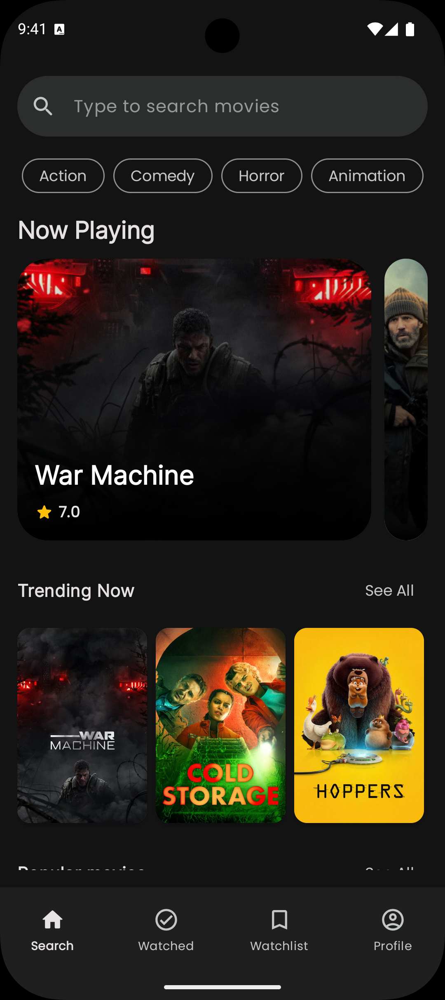
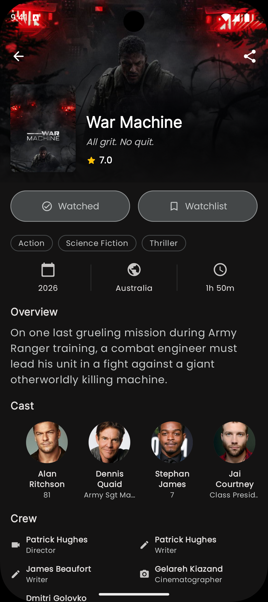
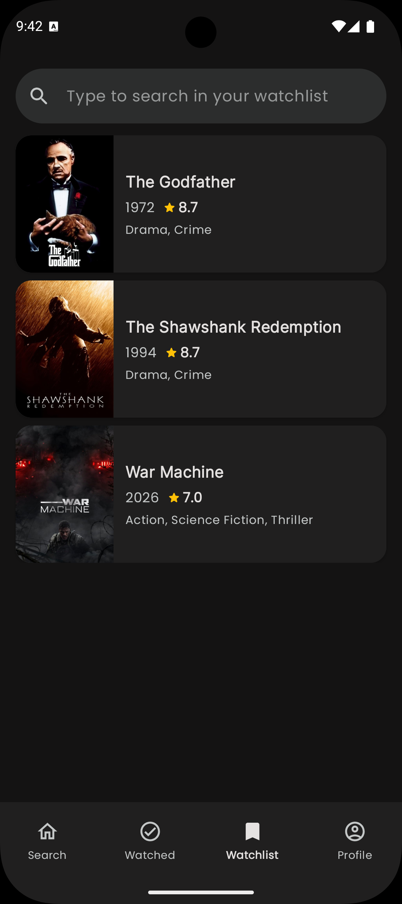
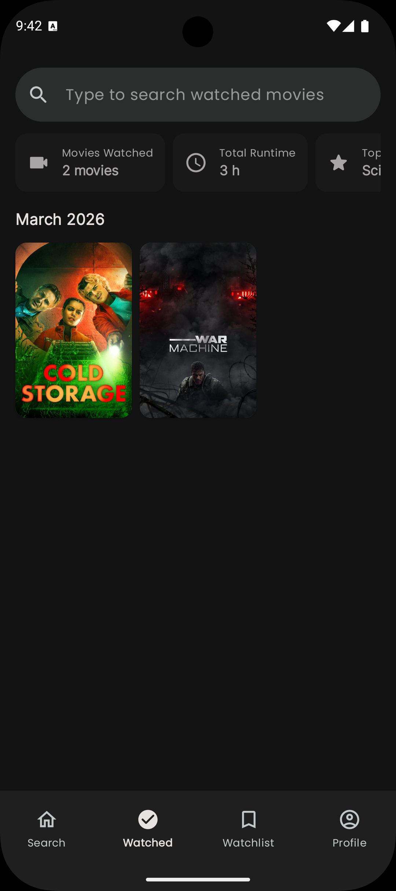
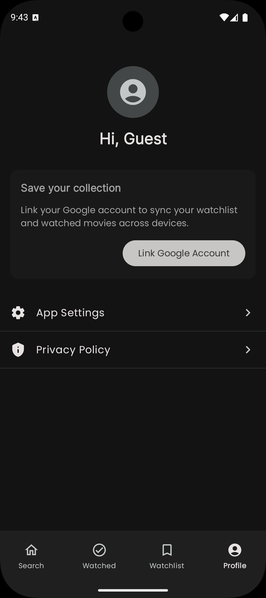
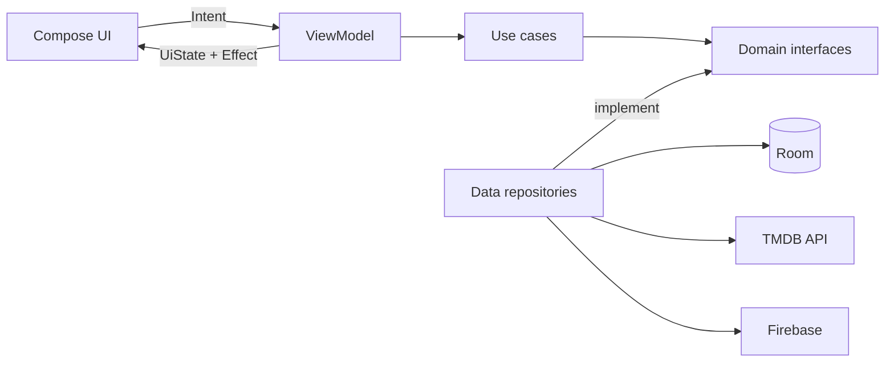

<p align="center">
  
</p>

<h1 align="center">Santoro</h1>

<p align="center">
  A movie companion built as a real Android product and an engineering showcase.<br />
  Discover films, keep a watchlist, track watched history, and sync across devices.
</p>

<p align="center">
  <a href="https://github.com/asensiodev/Santoro/actions/workflows/ci.yml"></a>
  <a href="https://app.codecov.io/gh/asensiodev/Santoro"></a>
  
  
  
  <a href="LICENSE"></a>
</p>

## Product

Santoro covers the complete loop around choosing and remembering films:

| Area | What is implemented |
|---|---|
| Discovery | Trending, popular, top-rated, upcoming, and genre-based collections with paginated grids |
| Search | Debounced movie search, recent queries, and trending suggestions |
| Movie detail | Cast, crew, ratings, runtime, genres, tagline, and direct TMDB deep links |
| Personal library | Watchlist, watched history, swipe actions, and viewing statistics |
| Data | Room-backed local data, cached browsing, Firebase authentication, and Firestore sync |
| Experience | Light and dark themes, pull to refresh, haptic feedback, and English and Spanish resources |

<p align="center">
  
</p>

<p align="center">
  
  
  
  
  
</p>

## Engineering

The codebase uses Clean Architecture with pragmatic, intent-driven MVI. Presentation depends on pure Kotlin domain contracts, while data implementations own Android and service integrations.



Key design choices:

- Feature and reusable library modules are split into public `api` and internal `impl` modules.
- ViewModels expose immutable `StateFlow` state and one-off effects; screens send sealed intents.
- The domain layer has no Android dependencies.
- Room entities and network models remain inside the data layer and are mapped to domain models.
- Gradle convention plugins centralize Compose, Hilt, quality, and testing configuration.
- Konsist architecture tests enforce module and dependency boundaries.

## Quality Signals

Quality checks run in [GitHub Actions](https://github.com/asensiodev/Santoro/actions/workflows/ci.yml) for production changes.

| Signal | Implementation |
|---|---|
| Static analysis | Detekt and ktlint |
| Unit and Flow tests | JUnit 5, MockK, Kluent, Turbine, and coroutine test dispatchers |
| Visual tests | Paparazzi screenshot tests for screens and design-system components |
| Device tests | Room and feature integration tests on an API 35 emulator |
| Architecture tests | Konsist boundary and convention checks |
| Coverage | Aggregate Kover reports, enforced CI floors, GitHub artifacts, and Codecov reporting |

The measured aggregate JVM baseline is **75.82% line coverage** and **71.20% branch coverage**. CI blocks regressions below **75% lines** or **71% branches** through `koverVerify`. Codecov independently renders the uploaded Kover XML report and provides history and changed-line coverage.

```sh
./gradlew :koverHtmlReport :koverVerify
```

Kover covers JVM-tested production logic. Instrumented and Paparazzi tests remain separate signals rather than being folded into that percentage.

## Stack

| Concern | Technology |
|---|---|
| UI | Jetpack Compose, Material 3, Navigation Compose, Coil 3 |
| State and async | Coroutines, Flow, StateFlow |
| Architecture | Clean Architecture, intent-driven MVI, multi-module API/implementation boundaries |
| Data | Retrofit, OkHttp, Room, DataStore |
| Services | Firebase Auth, Firestore, Remote Config, Crashlytics, Analytics |
| Dependency injection | Hilt |
| Build | Gradle Kotlin DSL, version catalogs, convention plugins, Java 21 |

## Repository Map

```text
app/                 Application entry point and navigation wiring
feature/             Login, search, movie detail, watchlist, watched, and settings
  <feature>/api/     Public routes and contracts
  <feature>/impl/    Internal presentation, domain, data, and DI
core/                Shared domain, data, database, network, sync, UI, and design system
library/             Observability, remote config, and secure storage abstractions
build-logic/         Gradle convention plugins
architecture-tests/  Automated module and coding-rule enforcement
```

## Data Source

Santoro uses the [TMDB API](https://www.themoviedb.org/) but is not endorsed or certified by TMDB. The API key is delivered through Firebase Remote Config rather than stored in the repository.

<p align="center">
  <a href="https://www.themoviedb.org/">
    
  </a>
</p>

## License

Source code is available under the [MIT License](LICENSE). Documentation under `docs/` is available under [CC BY 4.0](docs/LICENSE).

<p align="center">
  Built by <a href="https://github.com/asensiodev">Ángel Asensio</a>
</p>
