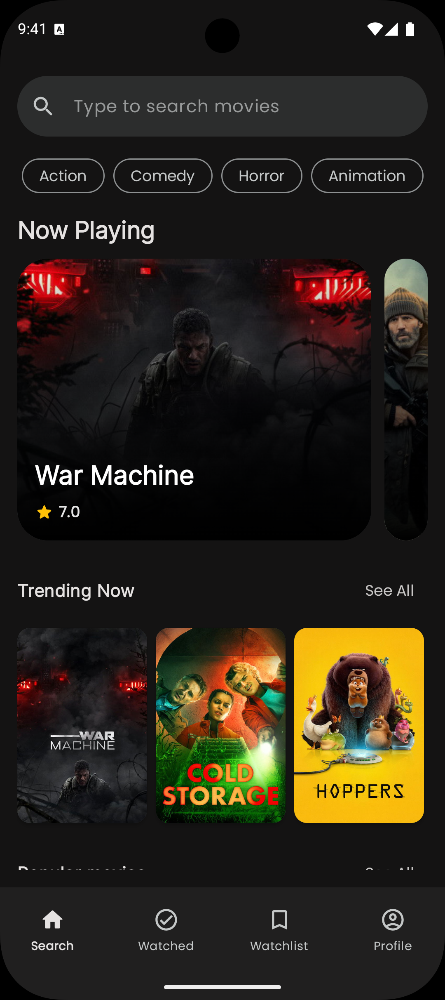
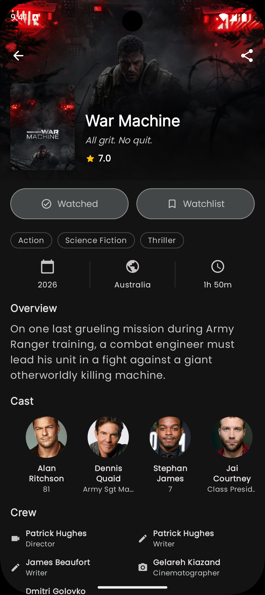
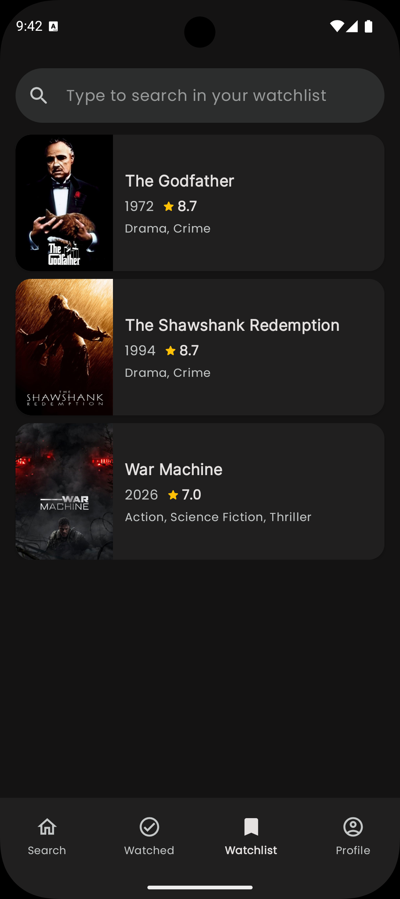
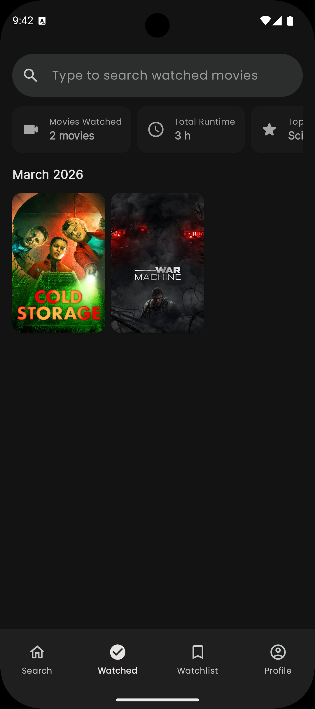
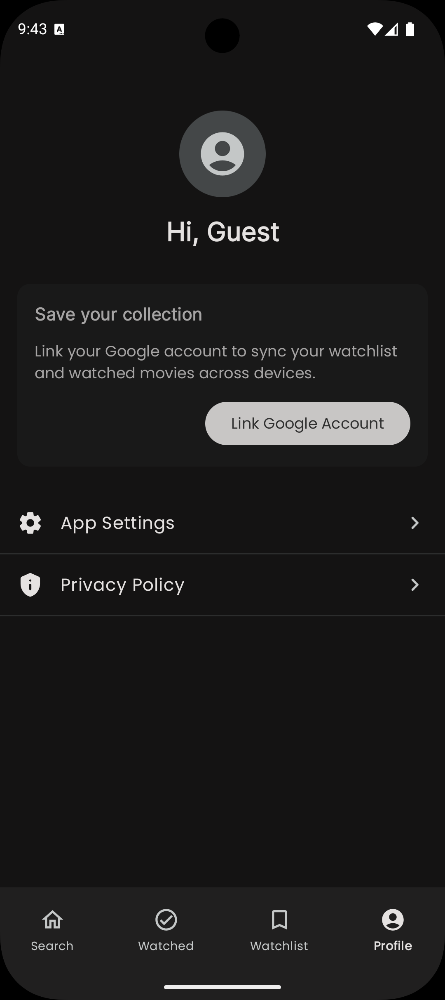
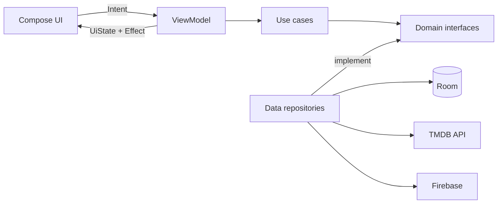

<p align="center">
  
</p>

<h1 align="center">Santoro</h1>

<p align="center">
  A movie companion built as a real Android product and an engineering showcase.<br />
  Discover films, keep a watchlist, track watched history, and sync across devices.
</p>

<p align="center">
  <strong><a href="https://play.google.com/store/apps/details?id=com.asensiodev.santoro">Download Santoro on Google Play</a></strong>
</p>

<p align="center">
  <a href="https://github.com/asensiodev/Santoro/actions/workflows/ci.yml"></a>
  <a href="https://app.codecov.io/gh/asensiodev/Santoro"></a>
  
  
  
  <a href="LICENSE"></a>
</p>

## Product

Santoro covers the complete loop around choosing and remembering films:

| Area | What is implemented |
|---|---|
| Discovery | Trending, popular, top-rated, upcoming, and genre-based collections with paginated grids |
| Search | Debounced movie search, recent queries, and trending suggestions |
| Movie detail | Cast, crew, ratings, runtime, genres, tagline, and direct TMDB deep links |
| Personal library | Watchlist, watched history, swipe actions, and viewing statistics |
| Data | Room-backed local data, cached browsing, Firebase authentication, and Firestore sync |
| Experience | Light and dark themes, pull to refresh, haptic feedback, and English and Spanish resources |

<p align="center">
  
</p>

<p align="center">
  
  
  
  
  
</p>

## Engineering

The codebase uses Clean Architecture with pragmatic, intent-driven MVI. Screens use Jetpack Compose, ViewModels expose state through Kotlin Flow, and Hilt provides dependency injection. The shared domain module is pure Kotlin; data implementations own Android and service integrations.


```mermaid
flowchart LR
    UI[Compose UI] -->|Intent| VM[ViewModel]
    VM -->|UiState + Effect| UI
    VM --> UC[Use cases]
    UC --> DI[Domain interfaces]
    DR[Data repositories] -->|implement| DI
    DR --> DB[(Room)]
    DR --> API[TMDB API]
    DR --> FB[Firebase]
```

Key design choices:

- Feature and reusable library modules are split into public `api` and internal `impl` modules.
- ViewModels expose immutable `StateFlow` state and one-off effects; screens send sealed intents.
- The shared `core:domain` module has no Android dependencies.
- Room entities and network models remain inside the data layer and are mapped to domain models.
- Gradle convention plugins centralize Compose, Hilt, Room, and testing configuration.
- Konsist tests check selected architecture boundaries and source conventions.

## Quality Signals

Quality checks run in [GitHub Actions](https://github.com/asensiodev/Santoro/actions/workflows/ci.yml) for production changes.

| Signal | Implementation |
|---|---|
| Static analysis | Detekt and ktlint |
| Unit and Flow tests | JUnit 5, MockK, Kluent, Turbine, and kotlinx-coroutines-test |
| Visual tests | Paparazzi screenshot tests for feature and design-system components |
| Android JVM tests | Robolectric for Android-dependent behavior, including WorkManager scheduling |
| Device tests | JUnit 4, AndroidX Test, Compose UI tests, Room integration and migration tests, and app navigation/authentication journeys |
| Architecture tests | Selected source-level boundary and convention checks with Konsist |
| Coverage | Aggregate Kover reports, enforced CI floors, GitHub artifacts, and Codecov reporting |

GitHub Actions runs static analysis, JVM tests and coverage, architecture tests, and a debug build, followed by selected instrumented integration and journey tests on an API 35 emulator. The workflow runs on pushes and pull requests to `main`, excluding documentation-only changes, and can also be started manually.

Kover enforces aggregate thresholds of **75% line coverage** and **71% branch coverage** through `koverVerify`. Codecov displays the uploaded Kover XML report. These thresholds describe the configured checks, not a guarantee of coverage for every module or behavior.

```sh
./gradlew :koverHtmlReport :koverVerify
```

The aggregate Kover report excludes generated code, Composables, and selected infrastructure classes. Instrumented tests provide additional behavioral checks outside that JVM coverage report.

The local pre-commit hook runs Detekt, ktlint, and Konsist when Kotlin files are staged. The app build installs it automatically; it can also be installed explicitly after cloning:

```sh
./gradlew copyGitHooks
```

Google Play releases are currently uploaded manually. Automatic delivery to Internal testing is [planned](docs/plan/FIP-024-automatic-internal-deployment.md).

## Stack

| Concern | Technology |
|---|---|
| UI | Jetpack Compose, Material 3, Navigation Compose, Coil 3 |
| State and async | Coroutines, StateFlow for screen state, SharedFlow for transient effects |
| Architecture | Clean Architecture, intent-driven MVI, multi-module API/implementation boundaries |
| Data | Retrofit, OkHttp, Room, DataStore, and WorkManager for background sync |
| Services | Firebase Auth, Firestore, Remote Config, Crashlytics, Analytics |
| Dependency injection | Hilt with constructor injection and module bindings |
| Build | Gradle Kotlin DSL, version catalogs, convention plugins, Java 21 |

## Repository Map

```text
app/                 Application entry point and navigation wiring
feature/             Login, search, movie detail, watchlist, watched, and settings
  <feature>/api/     Public routes and contracts
  <feature>/impl/    Internal presentation, domain, data, and DI
core/                Shared domain, data, database, network, sync, UI, and design system
library/             Observability, remote config, and secure storage abstractions
build-logic/         Gradle convention plugins
architecture-tests/  Selected architecture and source convention checks
```

## Reviewing the Project

For a code walkthrough, start with [search state and intents](feature/search-movies/impl/src/main/java/com/asensiodev/feature/searchmovies/impl/presentation/SearchMoviesViewModel.kt), [local persistence](core/database/src/main/java/com/asensiodev/santoro/core/database/data/repository/RoomDatabaseRepository.kt), and the [CI workflow](.github/workflows/ci.yml).

Local builds require JDK 21, the Android SDK, and Firebase configuration files, which are not committed. Running against your own Firebase project also requires Authentication, Firestore, and Remote Config setup. The Google Play version linked above is ready to try.

## Data Source

Santoro uses the [TMDB API](https://www.themoviedb.org/) but is not endorsed or certified by TMDB. The API key is delivered through Firebase Remote Config rather than stored in the repository.

<p align="center">
  <a href="https://www.themoviedb.org/">
    
  </a>
</p>

## License

Source code is available under the [MIT License](LICENSE). Documentation under `docs/` is available under [CC BY 4.0](docs/LICENSE).

<p align="center">
  Built by <a href="https://github.com/asensiodev">Ángel Asensio</a>
</p>
